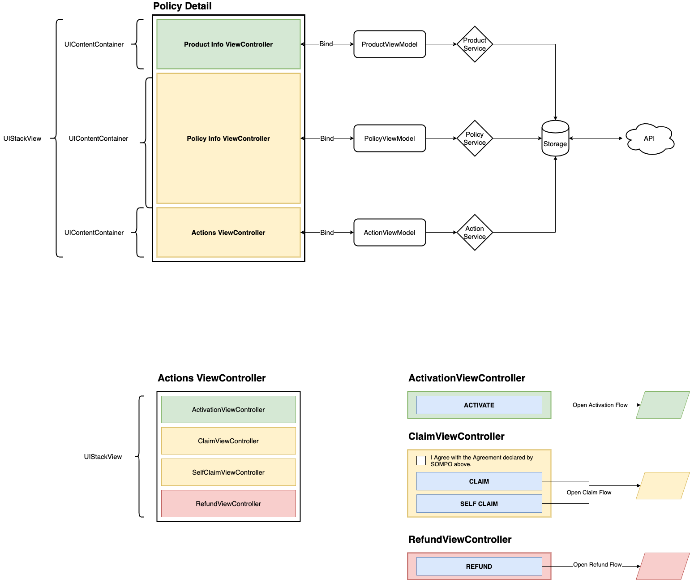

# DemoContainedViewController
Reduce Massive View Controller's compliexity by using UIContentContainer and ChildViewController.

## ChildViewController
When we build new screen, usually we jump right into adding new View Controller, and/or ViewModel and regarding Services. Then get started to add more SubViews and Logic handler for controls and events.

Later after few updates, the ViewController has been manipulated by adding new controls and events which after come out to be come too complex and hard to manage.
- Too many Buttons, Label, Textfield, Stackview. When we look into the Layout in Interface Builder, we don't know which button is doing what, and what is its IBOutlet -> take more effort to trace.
- Too much logic handler -> It is hard to manage and keep the source code clean. And this is a potential for a side-effect changes in future, which violates SOLID principle.

So, there is  much better way to solve the complexity of a Massive View Controller by using more ChildViewControllers.

Let's look into the Layout structure of the Policy Details with the new approach:

<kbd></kbd>

